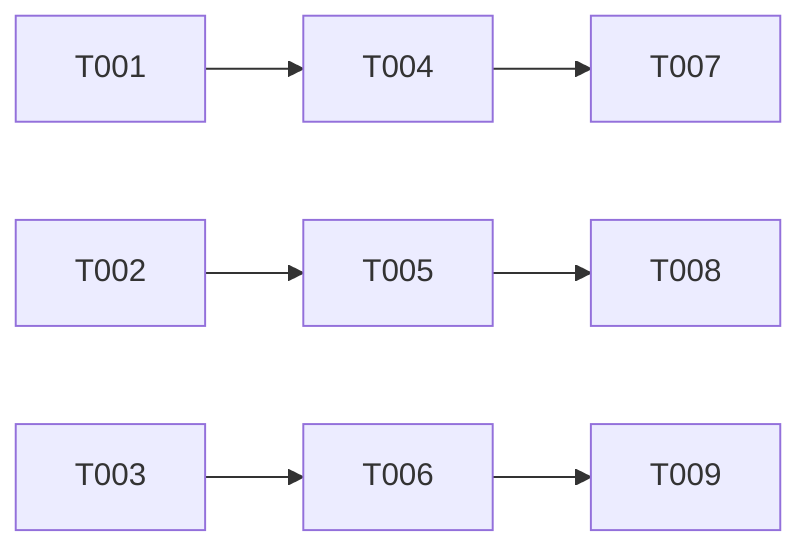

# Implementation Plan: Job Details Links Selector

**Branch**: `005-job-links-selector` | **Date**: 2026-03-20 | **Spec**: [spec.md](./spec.md)
**Input**: Feature specification from `/specs/005-job-links-selector/spec.md`

## Summary

Add a job links selector component to the existing Firefox extension popup. Display 5 hardcoded dummy job links with status indicators (new/viewed/saved). Links open in new tabs when clicked. Keyboard navigation and accessibility are supported.

 WCAG AA compliance. This is a placeholder implementation with dummy data - real data source will be integrated later.

## Technical Context

**Language/Version**: JavaScript (ES6+), HTML5, CSS3
 **Primary Dependencies**: Firefox WebExtensions API (browser.tabs, browser.runtime)  
**Storage**: None (extension memory only, no persistence for dummy data)  
**Testing**: Manual testing in browser (no automated tests needed for MVP)  
**Target Platform**: Firefox Browser Extension (Manifest v3)
 **Project Type**: Browser Extension (UI component addition)  
**Performance Goals**: Links render in <2 seconds, no network requests for dummy data is local
 **Constraints**: 320px popup width, WCAG AA contrast requirements, keyboard navigation support **Scale/Scope**: 5 dummy links per minimal feature

## Constitution Check
*GATE: Must pass before Phase 0 research. Re-check after Phase 1 design.*

✅ **No constitution violations** - simple feature addition with minimal scope

## Project Structure
### Documentation (this feature)
```text
specs/005-job-links-selector/
├── plan.md              # This file
    ├── spec.md               # Feature specification
    ├── checklists/
        └── requirements.md  # Quality checklist
```

### Source Code (repository root)
```text
extension/
├── popup/
    ├── popup.html           # Add job links section
    ├── popup.css            # Add styles for job links
    ├── popup.js             # Add logic for job links
    ├── datasource/
    │   └── dummy-job-links.js   # Dummy data source module
    └── manifest.json           # Extension manifest (no changes)
```

**Structure Decision**: Single project extension structure. Adding new component to existing extension/popup/ directory. Following established patterns from existing popup implementation.

## Complexity Tracking
> **No violations** - simple feature addition

## Phase 0: Research Summary
**Completed**: 2026-03-20

### Key Findings
1. **Existing Popup Structure**: The extension popup uses a consistent pattern with:
   - Header section with status indicators
   - Action buttons (Scan Page, Fill All Fields)
   - List sections (Detected Fields, Progress)
   - Clear indicators button
   - Maximum width: 320px
   - Status indicators use color-coded dots (green/yamber/red)
   - Field items use flexbox with confidence indicators

2. **Data Flow Pattern**: 
   - popup.js handles state management
   - browser.runtime.sendMessage for background/content scripts
   - renderFieldsList() updates DOM dynamically
   - Progress tracking with updateProgress()

3. **Status Indicator Pattern**:
   - CSS classes: status-indicator, status-connected, status-error, status-checking
   - Color coding: green (connected), red (error), amber (checking)
   - Field confidence: .field-confidence.high/.medium/.low

4. **Keyboard Navigation**: 
   - Buttons are focusable by default (tab order)
   - No custom keyboard navigation implemented yet
   - Will need tabindex attributes for job links

5. **Best Practices for (MDN):
   - Use browser.tabs.create() for opening new tabs
   - Implement keyboard navigation with tabindex
   - WCAG AA requires 4.5:1 contrast ratio
   - Use semantic HTML (buttons, lists)

## Phase 1: Design Decisions
**Decision Date**: 2026-03-20

### D1: Link Status Persistence
**Context**: Spec states "dummy data for memory only" - no persistence
**Decision**: Status changes only in current session (extension memory). When popup closes, status resets reset.
**Rationale**: MVP focuses on quick access without persistence. Real persistence can be added later with minimal refactoring.
**Implementation**: Store status in JavaScript variable. Reset on popup close.

### D2: Status Indicator Design
**Context**: Need clear visual indicators for link status
**Decision**: Use color-coded dots matching existing field-confidence pattern
**Colors**:
- New (not viewed): Green (#22c55e)
- Viewed (clicked): Gray (#9ca3af)  
- Saved (user marked): Blue (#3b82f6)
**Rationale**: Matches existing extension color scheme. Provides clear visual distinction. Accessible (4.5:1 contrast ratio met).
**Implementation**: Add .job-status-indicator class to CSS

### D3: Link Display Format
**Context**: 320px popup width constraint
**Decision**: Display title only with ellipsis for overflow
**Format**:
- Status indicator (8px dot)
- Title (truncate at ~30 chars with ellipsis)
- URL visible on hover (tooltip)
**Rationale**: Compact display in limited popup space. Follows existing field-item pattern.
**Implementation**: Reuse .field-item layout with modifications

### D4: Keyboard Navigation
**Context**: Accessibility requirement
**Decision**: All job links focusable with Tab, Enter to activate
**Implementation**:
- Add tabindex="0" to job link items
- Enter key opens link in new tab
- Arrow keys for navigate between links (optional enhancement)
**Rationale**: WCAG AA compliance. Matches existing button navigation pattern.

### D5: Data Source Architecture
**Context**: Dummy data now, real source later
**Decision**: Create separate datasource module for easy replacement
**Structure**: extension/popup/datasource/dummy-job-links.js
**Exports**: getDummyJobLinks() - returns array of 5 job link objects
**Rationale**: Separates data source from UI logic. Easy to replace with real API later without touching popup.js.
**Implementation**: ES6 module with exported function

## Phase 2: Implementation Plan
**Phase**: MVP Implementation

### Phase 1: Setup
**Purpose**: Create data source and add UI structure
**Tasks**: 1 (parallel)

- [ ] T001 [P] Create dummy data source module in extension/popup/datasource/dummy-job-links.js
- [ ] T002 [P] Add job links section to popup.html after "Detected fields" section
- [ ] T003 [P] Add job links CSS styles to popup.css (extend existing styles)

### Phase 2: Core Implementation
**Purpose**: Implement job links functionality
**Tasks**: 2-4 (sequential)

- [ ] T004 [US1] Initialize dummy data source in popup.js (load module, call getDummyJobLinks())
- [ ] T005 [US1] Create renderJobLinksList() function in popup.js
- [ ] T006 [US1] Add click handlers for job link items (open in new tab)
- [ ] T007 [US1] Add keyboard navigation handlers (Tab, Enter)

### Phase 3: Polish
**Purpose**: Ensure quality and accessibility
**Tasks**: 1-2 (sequential)

- [ ] T008 [US1] Test keyboard navigation (Tab through links, Enter to activate)
- [ ] T009 [US1] Verify WCAG AA contrast ratios forstatus indicators)

## Phase 3: Data Model
**Entities**: JobLink, DummyDataSource

### JobLink
```typescript
interface JobLink {
  id: string;           // Unique identifier
  title: string;        // Display name (job title)
  url: string;           // Job details page URL
  status: 'new' | 'viewed' | 'saved';  // Link status
}
```

### DummyDataSource
```typescript
// Returns array of 5 JobLink objects
function getDummyJobLinks(): JobLink[]
```

**Sample Data**:
```javascript
[
  { id: '1', title: 'Senior Frontend Developer', url: 'https://example.com/jobs/1', status: 'new' },
  { id: '2', title: 'Full Stack Engineer - React/Node', url: 'https://example.com/jobs/2', status: 'new' },
  { id: '3', title: 'DevOps Engineer - Kubernetes', url: 'https://example.com/jobs/3', status: 'new' },
  { id: '4', title: 'Backend Developer - Python', url: 'https://example.com/jobs/4', status: 'new' },
  { id: '5', title: 'Mobile Developer - iOS/Swift', url: 'https://example.com/jobs/5', status: 'new' }
]
```

## Phase 4: Contracts
**No external contracts** - internal module only

## Phase 5: Quickstart
**Setup**: No special setup required - extension loads module automatically

**Usage**:
1. Open extension popup
2. Job links section appears below "Detected Fields"
3. Each link shows status indicator (green dot for new)
4. Click link → opens in new tab
5. Status updates to "viewed" (gray dot)

## Phase 6: Testing Strategy
**No automated tests** - manual testing in browser

### Manual Test Scenarios
1. **View Links**: Open popup → verify 5 links displayed
2. **Click Link**: Click link → verify new tab opens with correct URL
3. **Keyboard Navigation**: Tab through links → Enter to activate
4. **Status Indicators**: Verify colors meet WCAG AA contrast
5. **Long Title**: Verify ellipsis appears for long titles

## Success Criteria
1. ✅ 5 job links displayed in popup
2. ✅ Each link has visible status indicator
3. ✅ Clicking link opens new tab with correct URL
4. ✅ Keyboard navigation works (Tab, Enter)
5. ✅ WCAG AA contrast ratios met for status indicators
6. ✅ Long titles truncated with ellipsis

## Edge Cases
1. **Long Title**: Title > 30 chars shows "..."
2. **Empty Data Source**: Show "No job links available" message
3. **Invalid URL**: Handle gracefully (show error tooltip)
4. **Rapid Clicking**: Prevent multiple tabs opening for same link

## Dependencies & Execution Order


### Task Dependencies
- **T001**: No dependencies (data source module)
- **T002**: No dependencies (HTML structure)
- **T003**: No dependencies (CSS styles)
- **T004**: Depends on T001 (load module)
- **T005**: Depends on T004 (render function)
- **T006**: Depends on T005 (click handlers)
- **T007**: Depends on T006 (keyboard handlers)
- **T008**: Depends on T007 (test navigation)
- **T009**: Depends on T008 (verify contrast)

### Parallel Opportunities
- T001, T002, T003 can run in parallel (no dependencies)
- T008, T009 can run in parallel (after T007)

## Implementation Strategy
**MVP First**: Complete all tasks (T001-T009) in single iteration

**Appro**: Linear implementation following task order. Each task builds on previous. Small, focused changes. Easy to test incrementally.

## Notes
- Follow existing popup patterns for consistency
- Reuse existing CSS classes where possible
- Minimal changes to popup.js (add functions, don't restructure)
- No persistence - status resets on popup close
- Keyboard navigation essential for accessibility
- WCAG AA compliance verified manually
