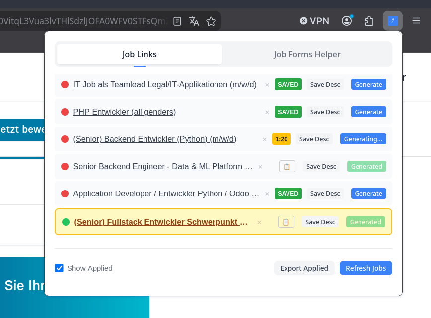
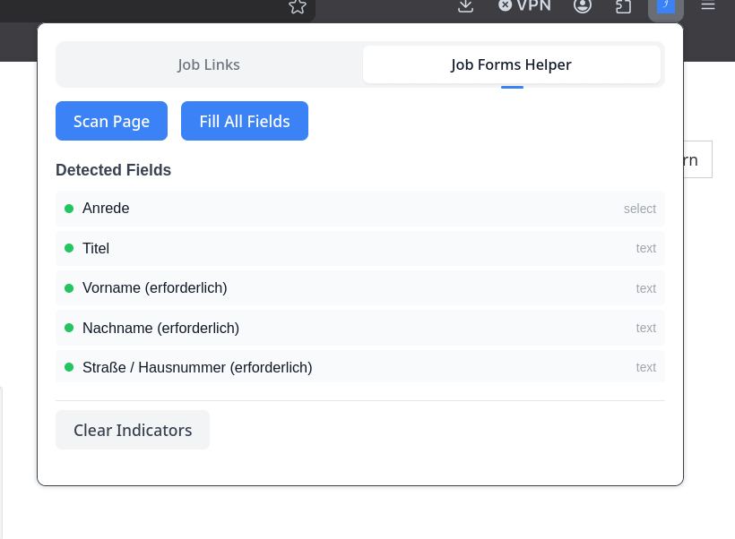

# Jobs

An AI-powered system for job application management: automatically fills job application forms using resume data (RAG pipeline), generates tailored cover letters, and tracks job postings with application status. The extension provides a Job Links Manager to monitor applied and pending job applications with local caching, real-time sync, and instant UI rendering.





## Overview

Job Forms Helper consists of four main components:

1. **Backend API** - A FastAPI service that processes form field labels and generates answers based on resume data stored in a vector database. Built with FastAPI and Pydantic v2, uses vector embeddings, reranking, and hybrid search.
2. **Browser Extension** - A Chrome/Firefox extension with two main features:
   - **Job Forms Helper** - Detects form fields on job application pages and fills them using the backend API
   - **Job Links Manager** - Tracks job postings with application status (Applied/In Progress/Not Applied), displays job lists, and exports applied jobs as CSV
   - Currently undergoing ES Module conversion refactoring
3. **n8n Automation Workflows** - No-code automation pipelines for job offers extraction, skills import, application writer, and job fit chat
4. **Test Suite** - Comprehensive testing including unit, integration, end-to-end, and load tests

Git repository: `git@github.com:aliuosio/jobs.git`
Latest commit: `c7d6556356af0216b71e0a29af25b4e5f2c62aed`

**Knowledge Graph Sync:** This project architecture is fully mapped in Memory-MCP graph with 13 entities and 17 relations tracking modules, dependencies, and directory structure.

## Architecture

```
┌─────────────────────────────────────────────────────────────────┐
│                     Firefox Extension                            │
│  ┌──────────────┐  ┌──────────────┐  ┌──────────────┐          │
│  │Content Script│→ │ Form Scanner │  │ Field Filler │          │
│  └──────────────┘  └──────────────┘  └──────────────┘          │
│         │                                    ↑                   │
│         ↓                                    │                   │
│  ┌──────────────┐                   ┌──────────────┐           │
│  │ API Client   │──────────────────→│Backend API   │           │
│  └──────────────┘                   └──────────────┘           │
└─────────────────────────────────────────────────────────────────┘
                                              │
                                              ↓
┌─────────────────────────────────────────────────────────────────┐
│                       Backend Services                          │
│  ┌──────────────┐  ┌──────────────┐  ┌──────────────┐          │
│  │Embedder Svc  │→ │ Retriever Svc│→ │ Generator Svc│          │
│  │(Mistral)     │  │ (Qdrant)     │  │ (Mistral)    │          │
│  └──────────────┘  └──────────────┘  └──────────────┘          │
│                                                                   │
│  ┌──────────────┐  ┌──────────────┐  ┌──────────────┐          │
│  │Field Classif.│  │Validation Svc│  │Job Offers Svc│          │
│  └──────────────┘  └──────────────┘  └──────────────┘          │
│                                              │                   │
│                                              ↓                   │
│                                    ┌──────────────┐             │
│                                    │  PostgreSQL  │             │
│                                    │  + Redis     │             │
│                                    └──────────────┘             │
└─────────────────────────────────────────────────────────────────┘
```

## Quick Start

### Prerequisites

- Docker and Docker Compose
- Mistral API key (for embeddings and inference)
- Firefox browser (for the extension)

### 1. Configure Environment

```bash
# Copy the example environment file
cp .env.example .env

# Edit .env and add your Mistral API key
# MISTRAL_API_KEY=your_api_key_here
```

### 2. Start Services

```bash
docker-compose up -d
docker compose logs -f n8n # wait for the workflows to be imported
```

This starts:

- **Qdrant** (vector database) on ports 6333/6334
- **PostgreSQL** (persistent database) on port 5432
- **Redis** (cache layer) on port 6379
- **n8n** (no-code automation workflows) on port 5678
- **Backend API** on port 8000

n8n workflows include:

- Job Offers Extractor
- Job Skills Import
- Job Application Writer
- Jobs Fit Chat
- Cover Letter Generation Workflow

### 3. Verify Services

```bash
# Check backend health
curl http://localhost:8000/health

# Run configuration validation
curl http://localhost:8000/validate
```

### 4. Install Firefox Extension

1. Open Firefox and navigate to `about:debugging#/runtime/this-firefox`
2. Click "Load Temporary Add-on"
3. Select any file from the `extension/` directory
4. The extension icon will appear in your toolbar

## License

This project is licensed under the MIT License - see the [LICENSE](LICENSE) file for details.
