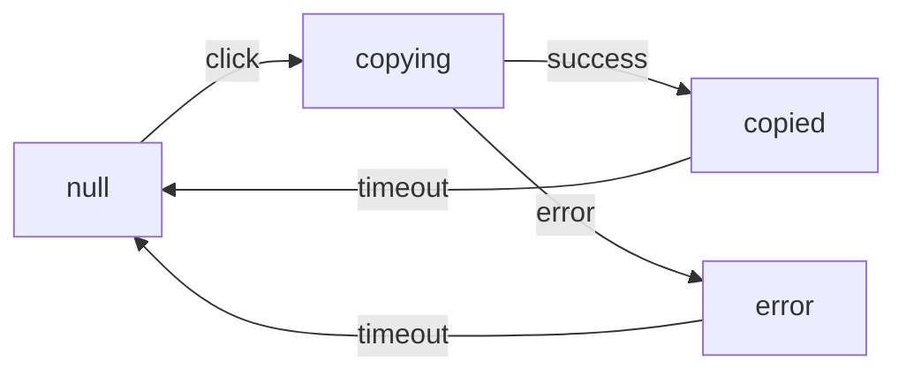
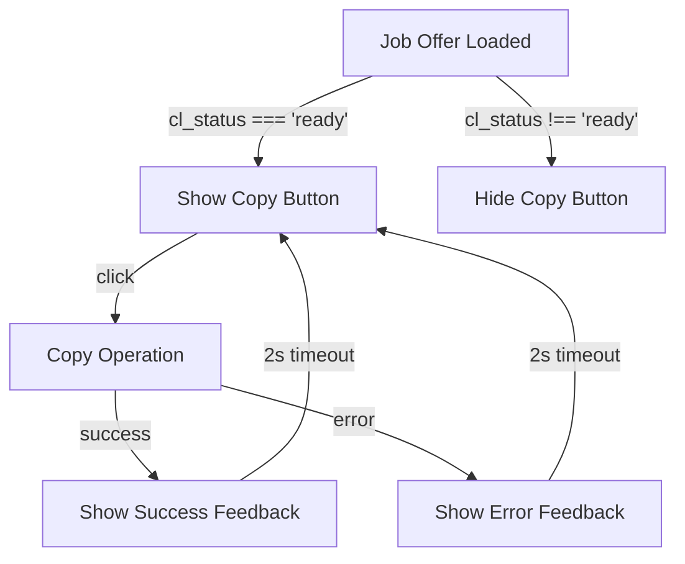
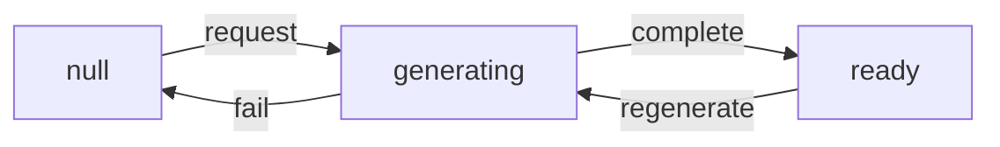
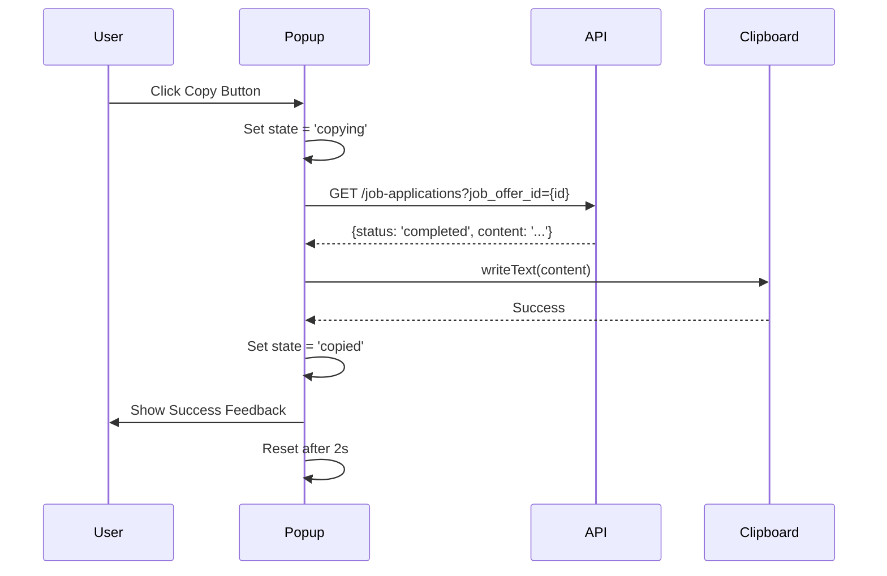
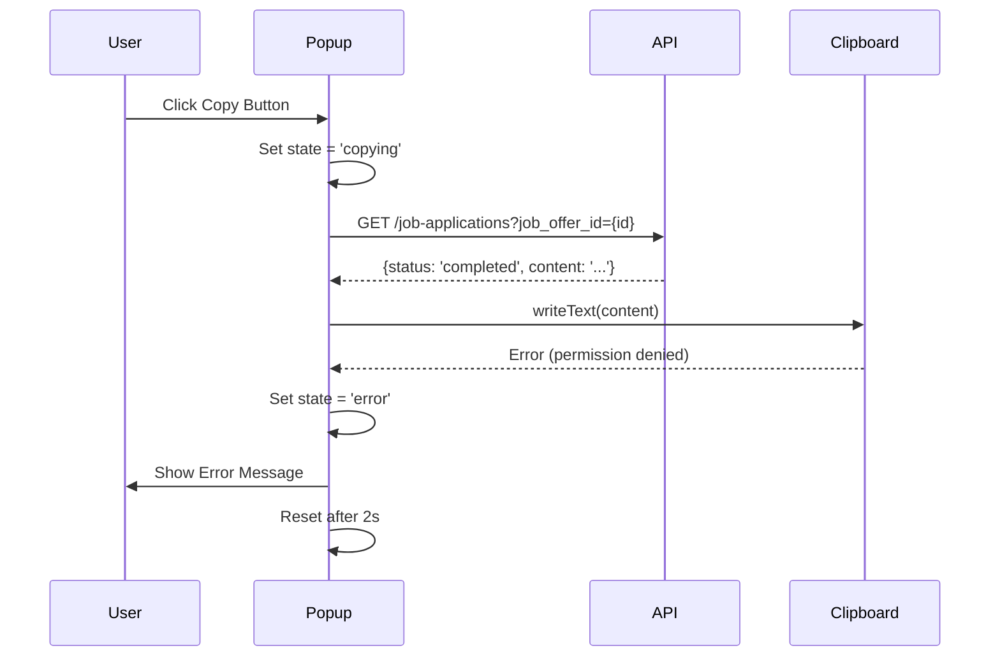

# Data Model: Copy to Clipboard Button

**Feature**: 008-fix-copy-clipboard-button | **Date**: 2026-04-21

## Entities

### 1. CopyButtonState

**Purpose**: Track the state of each copy button in the extension popup

**Fields**:
```typescript
interface CopyButtonState {
  jobId: string;           // Unique identifier for the job
  state: 'null' | 'copying' | 'copied' | 'error';  // Current button state
  timeoutId?: number;     // Timeout ID for reverting visual state
  lastError?: string;      // Last error message (if applicable)
}
```

**Relationships**:
- One-to-one with JobOffer (via jobId)
- Managed by CopyButtonStateMap

**Validation Rules**:
- `jobId` must be non-empty string
- `state` must be one of the defined values
- `timeoutId` cleared when state changes

**State Transitions**:


### 2. JobOffer (Extended)

**Purpose**: Represent a job posting with cover letter status

**Extended Fields**:
```typescript
interface JobOffer {
  id: string;
  title: string;
  url: string;
  // ... existing fields
  cl_status: 'null' | 'generating' | 'ready';  // Cover letter status
  cl_content?: string;  // Cover letter content (when ready)
}
```

**Relationships**:
- Has-one CopyButtonState (via id)
- May-have-one JobApplication

**Validation Rules**:
- `cl_status` must match API response states
- `cl_content` only present when `cl_status === 'ready'`

### 3. JobApplication

**Purpose**: Represent a generated job application with cover letter

**Fields**:
```typescript
interface JobApplication {
  id: string;
  job_offer_id: string;
  status: 'completed' | 'processing' | 'none';
  content: string;  // Cover letter text
  created_at: string;
  updated_at: string;
}
```

**Relationships**:
- Belongs-to JobOffer (via job_offer_id)
- Determines CopyButtonState visibility

**Validation Rules**:
- `status` must match API response values
- `content` required when `status === 'completed'`

## API Response Models

### GET /job-applications?job_offer_id={id}

**Success Response (200)**:
```typescript
interface JobApplicationResponse {
  status: 'completed' | 'processing' | 'none';
  content?: string;  // Only present when status === 'completed'
  job_offer_id: string;
  created_at?: string;
  updated_at?: string;
}
```

**Error Responses**:
- 404: Job application not found
- 401: Unauthorized
- 500: Server error

## State Machine

### Copy Button Visibility



### Cover Letter Generation



## Data Flow

### Copy Operation Sequence



### Error Handling Flow



## Validation Rules

### Button State Validation

1. **Visibility**: Button only visible when `jobOffer.cl_status === 'ready'`
2. **Click Handling**: Button disabled during copy operation
3. **State Transitions**: Only valid transitions allowed
4. **Timeout Management**: Clear timeouts when state changes

### API Response Validation

1. **Status Values**: Must be 'completed', 'processing', or 'none'
2. **Content Presence**: Required when status === 'completed'
3. **Job Offer ID**: Must match requested ID
4. **Error Handling**: Graceful degradation for all error cases

## Implementation Notes

### State Management

```javascript
// Using Map for O(1) access
const copyButtonState = new Map(); // jobId → CopyButtonState

function getButtonState(jobId) {
  return copyButtonState.get(jobId) || { state: 'null' };
}

function setButtonState(jobId, newState) {
  const current = copyButtonState.get(jobId) || {};
  if (current.timeoutId) clearTimeout(current.timeoutId);
  copyButtonState.set(jobId, { ...current, ...newState });
}
```

### Cover Letter Status Check

```javascript
async function checkCoverLetterStatus(jobId) {
  try {
    const response = await fetch(`/job-applications?job_offer_id=${jobId}`);
    const data = await response.json();
    
    if (data.status === 'completed') {
      return { 
        status: 'ready', 
        content: data.content 
      };
    } else if (data.status === 'processing') {
      return { status: 'generating' };
    } else {
      return { status: 'null' };
    }
  } catch (error) {
    console.error('API error:', error);
    return { status: 'null', error: error.message };
  }
}
```

### Clipboard Copy Operation

```javascript
async function copyToClipboard(jobId) {
  const jobOffer = getJobOffer(jobId);
  if (!jobOffer || jobOffer.cl_status !== 'ready') return false;

  try {
    await navigator.clipboard.writeText(jobOffer.cl_content);
    return true;
  } catch (error) {
    console.error('Clipboard error:', error);
    return false;
  }
}
```

## Testing Data

### Test Cases

1. **Happy Path**: Job with ready cover letter → successful copy
2. **API Error**: Job with ready status but API fails
3. **Clipboard Error**: Permission denied
4. **Rapid Clicks**: Multiple clicks during copy operation
5. **Pre-existing Cover Letter**: Job loads with existing application
6. **Message Positioning**: Success/error messages below job list

### Test Data

```javascript
const testJobOffer = {
  id: 'test-123',
  title: 'Test Job',
  url: 'https://example.com/job',
  cl_status: 'ready',
  cl_content: 'Test cover letter content...'
};

const testJobApplication = {
  id: 'app-456',
  job_offer_id: 'test-123',
  status: 'completed',
  content: 'Test cover letter content...',
  created_at: '2026-04-21T10:00:00Z',
  updated_at: '2026-04-21T10:00:00Z'
};
```

## Performance Considerations

### Optimization Strategies

1. **DOM Caching**: Cache frequently accessed elements
2. **Debouncing**: Prevent rapid state changes
3. **Batch Updates**: Group visual updates
4. **Memory Management**: Clear timeouts and event listeners

### Performance Metrics

- Copy operation: <200ms (SC-002)
- Visual feedback: <200ms (SC-002)
- Error display: <1s (SC-003)
- Memory usage: No leaks from timeout accumulation

## Security Considerations

### Clipboard Access

1. **Secure Context**: Check `window.location.protocol === 'https:'`
2. **Permission Handling**: Graceful degradation for denied permissions
3. **Error Messages**: Clear, actionable instructions for users
4. **Data Validation**: Validate API responses before clipboard operations

### Data Privacy

1. **Content Validation**: Ensure only valid cover letter text is copied
2. **Error Logging**: Log errors without sensitive content
3. **User Feedback**: Never expose internal errors to users
4. **Timeout Management**: Prevent memory leaks from uncleared timeouts