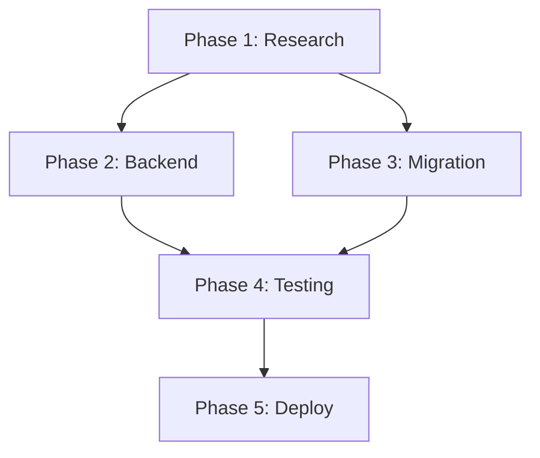

# Implementation Plan: Hybrid Search Upgrade

## Overview

Add hybrid search (70% vector + 30% BM25) to the retriever-service to improve search quality for domain-specific terms.

## Phase 1: Research & Validation (1-2 days)

### 1.1 Qdrant Sparse Vector Support
- [ ] Verify Qdrant version in docker-compose supports sparse vectors (v1.10+)
- [ ] Test Qdrant hybrid query API locally
- [ ] Document sparse vector format requirements

### 1.2 Sparse Embedding Options
- [ ] Research Qdrant built-in sparse embedding vs custom tokenizer
- [ ] Evaluate SPLADE vs BM25 tokenization
- [ ] Decision: Use custom BM25 tokenizer (backend-only generation)

## Phase 2: Backend Implementation (2-3 days)

### 2.1 Configuration
- [ ] Add hybrid search environment variables to `src/config.py`
- [ ] Add to `.env.example`

### 2.2 Sparse Tokenizer Service (Backend)
- [ ] Create `src/services/sparse_tokenizer.py`
- [ ] Implement BM25-style tokenization with custom tokenizer
- [ ] Add phrase detection for multi-word queries
- [ ] Generate sparse vectors at ingestion time in backend

### 2.3 Retriever Service Update
- [ ] Modify `src/services/retriever.py` for hybrid search
- [ ] Implement fallback to pure vector if sparse unavailable
- [ ] Add hybrid scoring with configurable weights

### 2.4 Qdrant Client Update
- [ ] Update collection creation to include sparse vectors config
- [ ] Implement hybrid query method

## Phase 3: Data Migration (1 day)

### 3.1 Backend Ingestion Update
- [ ] Add sparse vector generation to profile ingestion endpoint
- [ ] Modify `src/services/embedder.py` to generate sparse vectors alongside dense
- [ ] Ensure sparse vectors are stored in Qdrant at upsert time

### 3.2 Collection Migration
- [ ] Create migration script for existing collection (re-generate sparse vectors)
- [ ] Re-ingest resume data with sparse vectors
- [ ] Verify data integrity

## Phase 4: Testing (1-2 days)

### 4.1 Unit Tests
- [ ] Test sparse tokenizer
- [ ] Test hybrid scoring
- [ ] Test fallback behavior

### 4.2 Integration Tests
- [ ] Test hybrid search end-to-end
- [ ] Test with domain-specific terms
- [ ] Test phrase bonus

### 4.3 Performance Tests
- [ ] Benchmark hybrid vs pure vector latency
- [ ] Verify <500ms overhead

## Phase 5: Documentation & Deployment

- [ ] Update `docs/technical-overview.md`
- [ ] Update Memory MCP with architecture change
- [ ] Deploy to production

## Dependencies

## Risk Mitigation

| Risk | Mitigation |
|------|------------|
| Qdrant version incompatibility | Verify before implementation; fallback to pure vector |
| Sparse vector generation complexity | Start with simple tokenization; optimize later |
| Performance regression | Benchmark early; keep fallback available |
| Data migration failure | Keep backup of existing collection |